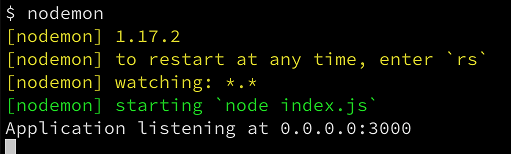
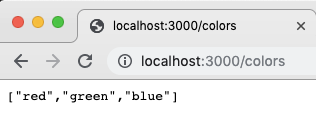
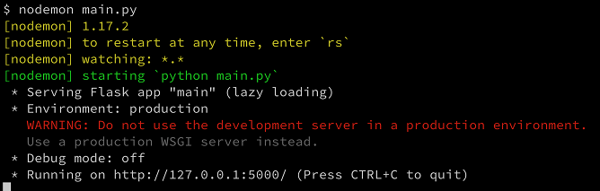
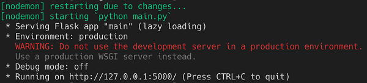
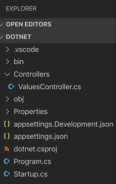
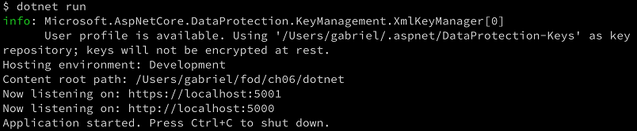
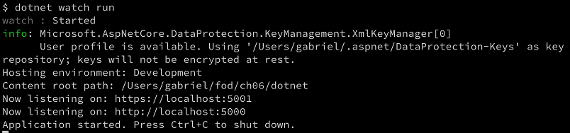
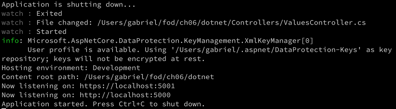
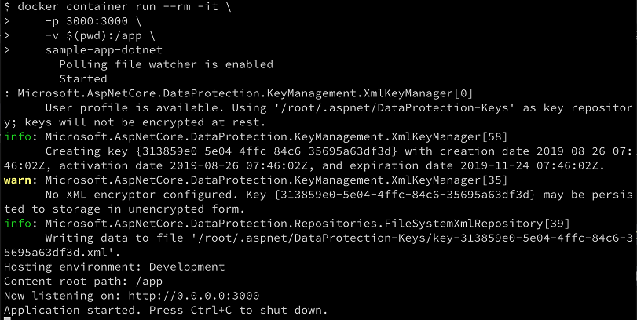
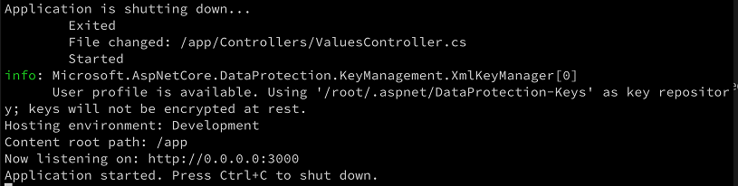

# **Auto restarting code upon changes**
Cool—in the last section, we showed how we can massively reduce friction by volume mapping the source code folder in the container, thus avoiding having to rebuild the container image and rerun the container over and over again.

Yet we still feel some remaining friction. The application running inside the container does not automatically restart when a code change happens. Thus, we have to manually stop and restart the container to pick up the new changes.

# Auto-restarting for Node.js
If you have been coding for a while, you will certainly have heard about helpful tools that can run your applications and restart them automatically whenever they discover a change in the code base. For Node.js applications, the most popular such tool is nodemon. We can install nodemon globally on our system with the following command:

```
$ npm install -g nodemon
```

Now, having **nodemon** available, instead of starting our application (for example, on the host) with **node index.js**, we can just execute **nodemon** and we should see the following:



Using nodemon to run a Node.js application

Evidently, **nodemon** has recognized, from parsing our **package.json** file, that it should use **node index.js** as the start command.

Now try to change some code, for example, add the following code snippet at the end of **index.js** and then save the file:

```
app.get('/colors', (req,res)=>{
 res.send(['red','green','blue']);
})
```
Look at the terminal window. Did you see something happening? You should see this additional output:

```
[nodemon] restarting due to changes...
[nodemon] starting `node index.js`
Application listening at 0.0.0.0:3000
```

This clearly indicates that **nodemon** has recognized some changes and automatically restarted the application. Try it out with your browser by navigating to **localhost:3000/colors**. You should see the following expected output in the browser:



Getting colors

This is cool—you got this result without having to manually restart the application. This makes us yet another bit more productive. Now, can we do the same within the container? Yes, we can. We won't use the start command node **index.js**, as defined in the last line of our **Dockerfile**:

```
CMD node index.js
```

We will use nodemon instead.

Do we have to modify our Dockerfile? Or do we need two different Dockerfiles, one for development and one for production?

Our original**Dockerfile** creates an image that unfortunately does not contain nodemon. Thus, we need to create a new Dockerfile. Let's call it **Dockerfile-dev**. It should look like this:

```
FROM node:latest          
RUN npm install -g nodemon
WORKDIR /app
COPY package.json ./
RUN npm install
COPY . .
CMD nodemon
```

Comparing with our original Dockerfile, we have added line 2 where we install nodemon. We have also changed the last line and are now using nodemon as our start command.

Let's build our development image as follows:

```
$ docker image build -t sample-app-dev .
```
We'll run a container like this:

```
$ docker container run --rm -it \
   -v $(pwd):/app \
   -p 3000:3000 \
   sample-app-dev

PS>  docker container run --rm -it `
   -v $pwd/node:/app `
   -p 3000:3000 `
   sample-app-dev

```

Now, while the application is running in the container, change some code, save, and notice that the application inside the container is automatically restarted. Thus, we have achieved the same reduction in friction running in a container as we did when running directly on the host.

You may ask, does this only apply to Node.js? No, fortunately many of the popular languages support similar concepts.

# Auto-restarting for Python
Let's look at how the same thing works for Python:

- First, create a new project folder for our sample Python application and navigate to it:

```
 cd ~/DJK/Lab-04-Debugging/sample/python
```

- Open VS Code from within this folder with the command **code ..**

- We will create a sample Python application that uses the popular Flask library. Thus, add a **requirements.txt** file with the **flask** content to this folder.

Next, add a main.py file and give it this content:

```
from flask import Flask
app = Flask(__name__)
 
@app.route("/")
def hello():
  return "Hello World!"
 
if __name__ == "__main__":
  app.run()
```

This is a simple Hello World type app that implements a single RESTful endpoint at **localhost:5000/**.

Before we can run and test this application, we need to install the dependencies—Flask in our case. In the terminal, run the following:
```
$ pip install -r requirements.txt
```

This should install Flask on your host. We are now ready to go.

- When using Python, we can also use **nodemon** to have our application auto restart upon any changes to the code. For example, assume that your command to start the Python application is **python main.py**. Then you would just use nodemon as follows:
```
$ nodemon main.py
```
You should see this:



Using **nodemon** to start and monitor a Python application, we can test the application by using **curl** and should see this:
```
$ curl localhost:5000/
Hello World!
```

- Let's now modify the code by adding this snippet to **main.py**, right after the definition of the / endpoint, and save:

```
from flask import jsonify
 
@app.route("/colors")
def colors():
   return jsonify(["red", "green", "blue"])
```

**nodemon** will discover the changes and restart the Python app, as we can see in the output produced in the terminal:




nodemon discovering a change in the Python code

- Once again, believing is good, testing is better. Thus, let's use our friend curl once again to probe the new endpoint and see what we get:
```
$ curl localhost:5000/colors
["red", "green", "blue"]
```


Nice—it works! With that, we have covered Python. .NET is another popular platform. Let's see if we can do something similar to this when developing a C# application on .NET.

# Auto-restarting for .NET

Our next candidate is a .NET application written in C#. Let's look at how auto-restart works in .NET.

First, create a new project folder for our sample C# application and navigate to it:
```
$ cd ~/DJK/Lab-04-Debugging/sample/dotnet
```

- **Note:** If you have not done so before, please install .NET Core on your laptop or workstation. You can get it at https://dotnet.microsoft.com/download/dotnet-core. At the time of writing, version 2.2 is the current stable version. Once it's installed, check the version with **dotnet --version**. It is 2.2.401 for me.

Navigate to the source folder for this chapter:
```
mkdir ~/DJK/Lab-04-Debugging/sample/dotnet/webapi
cd ~/DJK/Lab-04-Debugging/sample/dotnet/webapi
```
From within this folder, use the dotnet tool to create a new Web API and have it placed in the dotnet subfolder:
```
$ dotnet new webapi -o dotnet
```
Navigate to this new project folder:

```
$ cd dotnet
```

Once again, use the **code .** command to open VS Code from within the **dotnet** folder.

- **Note:** If this is the first time you have opened a .NET Core 2.2 project with VS Code, then the editor will start to download some C# dependencies. Wait until all dependencies have been downloaded. The editor may also display a popup asking you to add the missing dependencies for our **dotnet** project. Click the **Yes** button in this case.

In the project explorer of VS Code, you should see this:



DotNet Web API project in the VS Code Project Explorer

- Please note the Controllers folder with the ValuesController.cs file in it. Open this file and analyze its content. It contains the definition for a ValuesController class, which implements a simple RESTful controller with GET, PUT, POST, and DELETE endpoints at api/values.

- From your terminal, run the application with dotnet run. You should see something like this:



Running the .NET sample Web API on the host
We can use curl to test the application as follows, for example:
```
$ curl --insecure https://localhost:5001/api/values
["value1","value2"]
```

The application runs and returns the expected result.

- **Note :** Please note that the application is configured to redirect **http://localhost:5000** to **https://localhost:5001**by default. But, this is an insecure endpoint and to suppress the warning, we use the --insecure switch.
- 
We can now try to modify the code in **ValuesController.cs** and return, say, three items instead of two from the first GET endpoint:

```
[HttpGet]
public ActionResult<IEnumerable<string>> Get()
{
    return new string[] { "value1", "value2", "value3" };
}
```

- Save your changes and rerun the curl command. Notice how the result does not contain the new added value. It is the same problem as we observed for Node.js and Python. To see the new updated return value, we need to (manually) restart the application.
- Thus, in your terminal, stop the application with Ctrl + C and restart it with dotnet run. Try the curl command again. The result should now reflect your changes.
- Luckily for us, the dotnet tool has the watch command. Stop the application by pressing Ctrl + C and execute dotnet watch run. You should see output resembling the following:



Running the .NET sample application with the watch task

- Notice the second line in the preceding output, which states that the running application is now watched for changes.

- Make another change in **ValuesController.cs**; for example, add a fourth item to the return value of the first **GET** endpoint and save. Observe the output in the terminal. It should look something like this:



Auto restarting the running sample .NET Core application

With that automatic restart of the application upon changes to the code, the result is immediately available to us and we can easily test it by running the curl command:

```
$ curl --insecure https://localhost:5001/api/values
["value1","value2","value3","value4"]
```

Now that we have auto restart working on the host, we can author a Dockerfile that does the same for the application running inside a container. In VS Code, add a new file called Dockerfile-dev to the project and add the following content to it:

```
FROM mcr.microsoft.com/dotnet/core/sdk:2.2
WORKDIR /app
COPY dotnet.csproj ./
RUN dotnet restore
COPY . .
CMD dotnet watch run
```

Before we can continue and build the container image, we need to add a slight modification to the startup configuration of the .NET application, such that the web server (Kestrel in this case) listens, for example, at **0.0.0.0:3000** and will thus be able to run inside a container and be accessible from outside of the container. Open the **Program.cs** file and make the following modification to the **CreateWebHostBuilder** method:

```
public static IWebHostBuilder CreateWebHostBuilder(string[] args) =>
    WebHost.CreateDefaultBuilder(args)
    .UseUrls("http://0.0.0.0:3000")
    .UseStartup<Startup>();
```
With the **UseUrls** method, we tell the web server to listen to the desired endpoints.

Now we're ready to build the container image:

- To build the image use the following command:
```
$ docker image build -f Dockerfile-dev -t sample-app-dotnet .
```
Once the image is built, we can run a container from it:
```
$ docker container run --rm -it \
   -p 3000:3000 \
   -v $(pwd):/app \
   sample-app-dotnet

PS> docker container run --rm -it `
   -p 3000:3000 `
   -v $pwd/:/app `
   sample-app-dotnet

```

We should see a similar output to that seen when running natively:



A .NET sample application running in a container

Let's test the application with our friend curl:

```
$ curl localhost:3000/api/values
["value1","value2","value3","value4"]
$
$ curl localhost:3000/api/values/1
value
```

No surprises here—it works as expected.

- Now let's do a code change in the controller and then save. Observe what's happening in the terminal window. We should see an output similar to this:



Auto restart happening to the .NET sample application running inside the container
Well, that's exactly what we expected. With this, we have removed most of the friction introduced by using containers when developing a .NET application.