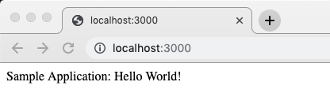

Evolving and testing code running in a container
When developing code that will eventually be running in a container, it is often the best approach to run the code in the container from the very beginning, to make sure there will be no unexpected surprises. But, we have to do this in the right way in order not to introduce any unnecessary friction into our development process. Let's first look at a naive way that we could run and test code in a container:

Create a new project folder and navigate to it:
```
$ cd ~/DJK/Lab-04-Debugging/sample/npm
```
Let's use npm to create a new Node.js project:

```
$ npm init
```
Accept all the defaults. Notice that a package.json file is created with the following content:

{
  "name": "l04",
  "version": "1.0.0",
  "description": "",
  "main": "index.js",
  "scripts": {
    "test": "echo \"Error: no test specified\" && exit 1"
  },
  "author": "",
  "license": "ISC"
}

We want to use the Express.js library in our Node application; thus, use npm to install it:
```
$ npm install express --save
```

This will install the newest version of Express.js on our machine and, because of the --save parameter, add a reference to our package.json file that looks similar to this:

```
"dependencies": {
  "express": "^4.17.1"
}
```

Start VS Code from within this folder:
```
$ code .
```

In VS Code, create a new index.js file and add this code snippet to it. Do not forget to save:
```
const express = require('express');
const app = express();

app.listen(3000, '0.0.0.0', ()=>{
    console.log('Application listening at 0.0.0.0:3000');
})

app.get('/', (req,res)=>{
    res.send('Sample Application: Hello World!');
})
```

From back within your terminal window, start the application:
```
$ node index.js
```

You should see this as the output:

```
Application listening at 0.0.0.0:3000
```

This means that the application is running and ready to listen at 0.0.0.0:3000. You may ask yourself what the meaning of the host address 0.0.0.0 is and why we have chosen it. We will come back to that later, when we run the application inside a container. For the moment, just know that 0.0.0.0 is a reserved IP address with a special meaning, similar to the loopback address 127.0.0.1. The 0.0.0.0 address simply means all IPv4 addresses on the local machine. If a host has two IP addresses, say 52.11.32.13 and 10.11.0.1, and a server running on the host listens on 0.0.0.0, it will be reachable at both of those IPs.

Now open a new tab in your favorite browser and navigate to **localhost:3000**. You should see this:




Sample Node.js app running in a browser

Great—our Node.js application is running on our developer machine. Stop the application by pressing Ctrl + C in the terminal.


- Now we want to test the application we have developed so far by running it inside a container. To do this, we have to create a Dockerfile first, so that we can build a container image, from which we can then run a container. Let's use VS Code again to add a file called Dockerfile to our project folder and give it the following content:


```
FROM node:latest
WORKDIR /app
COPY package.json ./
RUN npm install
COPY . .
CMD node index.js
```

We can then use this Dockerfile to build an image called sample-app as follows:
```
$ docker image build -t sample-app .
```

After building, run the application in the container with this command:
```
$ docker container run --rm -it \
    --name my-sample-app \
    -p 3000:3000 \
    sample-app
```
docker container run --rm -it --name my-sample-app -p 3000:3000  sample-app

 The preceding command runs a container with the name **my-sample-app** from the container image **sample-app** and maps the container port **3000** to the equivalent host port. The port mapping is necessary; otherwise, we could not access the application running inside the container from outside the container. We will learn more about port mapping in , **Single-Host Networking**.

Similar to when we ran the application directly on our host, the output is as follows:

```
Application listening at 0.0.0.0:3000
```

- Refresh the browser tab from before (or open a new browser tab and navigate to localhost:3000, if you closed it). You should see that the application still runs and produces the same output as when running natively. This is good. We have just shown that our application not only runs on our host but also inside a container.
- Stop and remove the container by pressing Ctrl + C in the terminal.
- Now let's modify our code and add some additional functionality. We will define another HTTP GET endpoint at /hobbies. Please add the following code snippet to your index.js file:
```
const hobbies = [
  'Swimming', 'Diving', 'Jogging', 'Cooking', 'Singing'
];

app.get('/hobbies', (req,res)=>{
  res.send(hobbies);
})
```
- We can first test the new functionality on our host by running the app with node **index.js** and navigating to **localhost:3000/hobbies** in the browser. We should see the expected output in the browser window. Don't forget to stop the application with Ctrl + C when done testing.

Next, we need to test the code when it runs inside the container. Thus, first, we create a new version of the container image:

```
$ docker image build -t sample-app .
```

Next, we run a container from this new image:

```
$ docker container run --rm -it \
    --name my-sample-app \
    -p 3000:3000 \
    sample-app
```

- Now, we can navigate to **localhost:3000/hobbies** in our browser and confirm that the application works as expected inside the container too. Once again, don't forget to stop the container when done by pressing Ctrl + C.

We can repeat this sequence of tasks over and over again for each feature we add or any existing features we improve. It turns out that this is a lot of added friction compared to times when all the applications we developed always ran directly on the host.

However, we can do better. In the next section, we will look at a technique that allows us to remove most of the friction.

# Mounting evolving code into the running container
What if, after a code change, we do not have to rebuild the container image and rerun a container? Wouldn't it be great if the changes would immediately, as we save them in an editor such as VS Code, be available inside the container too? Well, exactly that is possible with volume mapping. In the last chapter, we learned how to map an arbitrary host folder into an arbitrary location inside a container. We want to leverage exactly that in this section.

We saw in , Data Volumes and Configuration, how we can map host folders as volumes in a container. If I want, for example, to mount a host folder, **/projects/sample-app**, into a container at /app, the syntax for this looks as follows:

```
$ docker container run --rm -it \
    --volume /projects/sample-app:/app \
    alpine /bin/sh
```

Notice the line **`--volume <host-folder>:<container-folder>`**. The path to the host folder needs to be an absolute path, as in the example, **/projects/sample-app**.

If we now want to run a container from our sample-app container image, and, if we do that from the project folder, then we can map the current folder into the /app folder of the container as follows:

```
$ docker container run --rm -it \
    --volume $(pwd):/app \
    -p 3000:3000 sample-app \
```
 docker container run --rm -it `
    --volume $pwd:/app `
    -p 3000:3000 sample-app 
```


Please note the **$(pwd)** in place of the host folder path. **$(pwd)** evaluates to the absolute path of the current folder, which comes in very handy.

Now, if we do mount the current folder into the container as described above, then whatever was in the **/app** folder of the **sample-app** container image will be overridden by the content of the mapped host folder, that is, in our case, the current folder. That's exactly what we want—we want the current source to be mapped from the host in the container.

Let's test whether it works:

- Stop the container if you have started it by pressing Ctrl + C.
- Then add the following snippet to the end of the index.js file:

```
app.get('/status', (req,res)=>{
  res.send('OK');
})
```

**Do not forget to save.**

- Then run the container again – this time without rebuilding the image first – to see what happens:
```
$ docker container run --rm -it \
    --name my-sample-app \
    --volume $(pwd):/app \
    -p 3000:3000 \
    sample-app

docker container run --rm -it `
    --name my-sample-app `
    --volume $pwd/npm/:/app `
    -p 3000:3000 `
    sample-app
```

In your browser, navigate to **localhost:3000/status** and expect to see the **OK** output in the browser window. Alternatively, you could use **curl** in another terminal window:

```
$ curl localhost:3000/status
OK
```

- **TIP:** For all those working on Windows and/or Docker for Windows, you can use the PowerShell command **Invoke-WebRequest** or **iwr** for short instead of **curl**. The equivalent to the preceding command would then be iwr **-Url localhost:3000/status**.

- Leave the application in the container running for the moment and make yet another change. Instead of just returning OK when navigating to **/status**, we want the message OK, all good to be returned. Make your modification and save the changes.
- Then execute the curl command again or, if you did use the browser, refresh the page. What do you see? Right—nothing happened. The change we made is not reflected in the running application.
- Well, let's double-check whether the change has been propagated in the running container. To do this, let's execute the following command:

```
$ docker container exec my-sample-app cat index.js
```

We should see something like this—I have shortened the output for readability:

```
...
app.get('/hobbies', (req,res)=>{
 res.send(hobbies);
})

app.get('/status', (req,res)=>{
 res.send('OK, all good');
})
...
```

Evidently, our changes have been propagated into the container as expected. Why, then, are the changes not reflected in the running application? Well, the answer is simple: for changes to be applied to the application, the application has to be restarted.

- Let's try that. Stop the container with the application running by pressing Ctrl + C. Then re-execute the preceding docker container run command and use curl to probe the endpoint localhost:3000/status. Now, the following new message should be displayed:
```
$ curl localhost:3000/status
 OK, all good
```

So, we have achieved a significant reduction in the friction in the development process by mapping the source code in the running container. We can now add new or modify existing code and test it without having to build the container image first. Yet, there is still a bit of friction left in play. We have to manually restart the container every time we want to test some new or modified code. Can we automate this? The answer is yes! We will demonstrate exactly this in the next section.