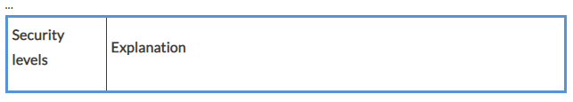

# **Instrumenting your code to produce meaningful logging information**
Once an application is running in production, it is impossible or strongly discouraged to interactively debug the application. Thus, we need to come up with other ways to find the root cause when the system is behaving unexpectedly or causing errors. 

The best way is to have the application generate detailed logging information that can then be used by the developers that need to track down any errors. Since logging is such a common task, all relevant programming languages or frameworks offer libraries that make the task of producing logging information inside an application straightforward. 

It is common to categorize the information output by an application as logs into so-called severity levels. Here is the list of those severity levels with a short description of each:

