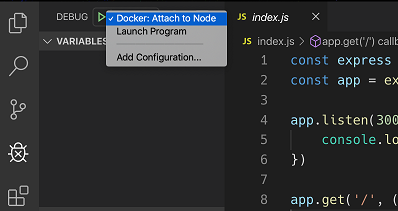
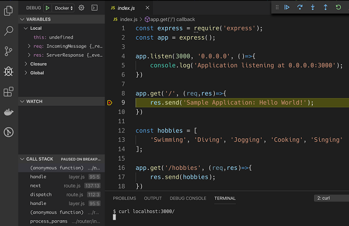
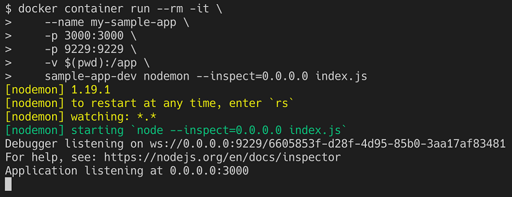
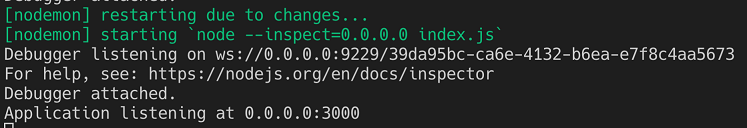
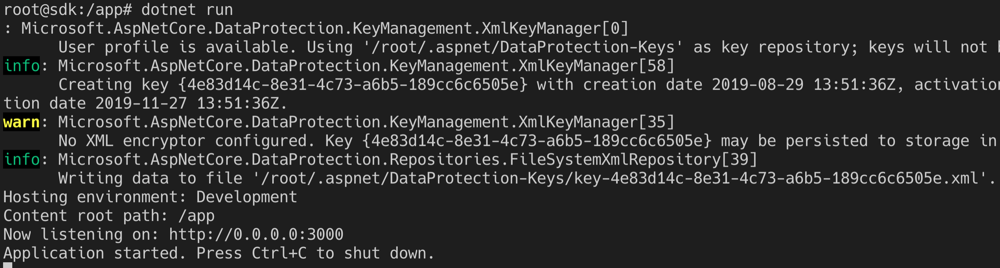
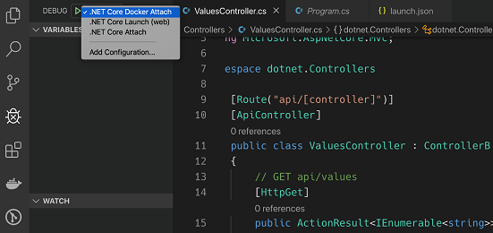
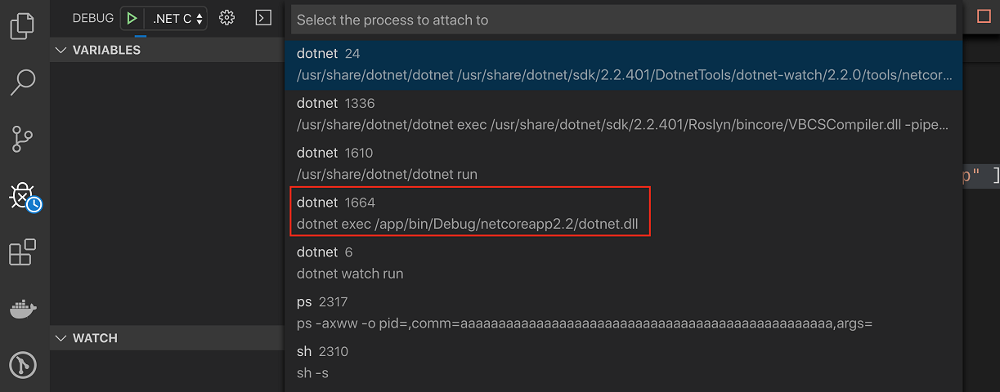
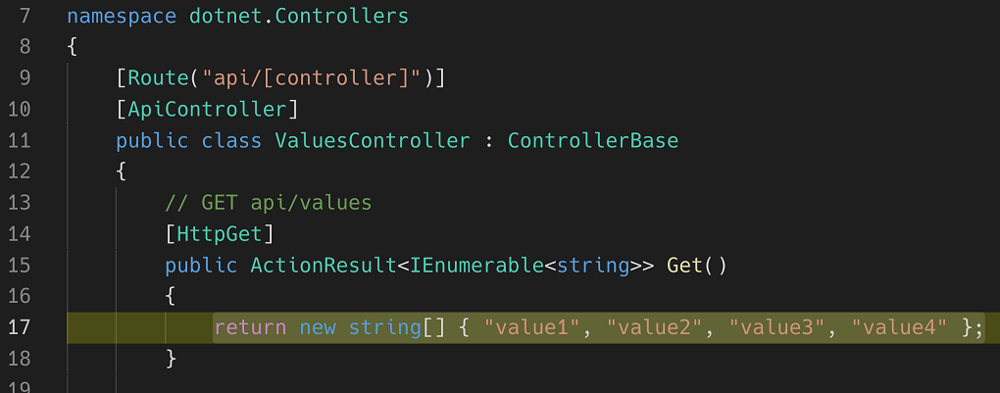

# **Line-by-line code debugging inside a container**
Before we dive into this section about the line-by-line debugging of code running inside a container, let me make a disclaimer. What you will learn here should usually be your last resort, if nothing else works. Ideally, when following a test-driven approach when developing your application, the code is mostly guaranteed to work due to the fact that you have written unit and integration tests for it and run them against your code, which also runs in a container. Alternatively, if unit or integration tests don't provide you with enough insight and you really need to debug your code line by line, you can do so having your code running directly on your host, thus leveraging the support of development environments such as Visual Studio, Eclipse, or IntelliJ, to name just a few IDEs.

With all this preparation, you should rarely need to have to manually debug your code as it is running inside a container. That said, let's see how you can do it!

In this section, we are going to concentrate exclusively on how to debug when using Visual Studio Code. Other editors and IDEs may or may not offer similar capabilities.

# Debugging a Node.js application
We'll start with the easiest one—a Node.js application. We will use our sample application in folder **~/DJK/Lab-04-Debugging/sample/node**, which we worked with earlier in this chapter:

- Make sure that you navigate to this project folder and open VS Code from within it:

```
$ cd ~/DJK/Lab-04-Debugging/sample/node
$ code .
```

- In the terminal window, from within the project folder, run a container with our sample Node.js application:
```
$ docker container run --rm -it \
   --name my-sample-app \
   -p 3000:3000 \
   -p 9229:9229 \
   -v $(pwd):/app \
   sample-app node --inspect=0.0.0.0 index.js

PS> docker container run --rm -it `
   --name my-sample-app `
   -p 3000:3000 `
   -p 9229:9229 `
   -v $pwd/:/app `
   sample-app node --inspect=0.0.0.0 index.js

```
Note how I map port **9229** to the host. This port is used by the debugger, and VS Studio will communicate with our Node application via this port. Thus it is important that you open this port—but only during a debugging session! Also note that we override the standard start command defined in the Dockerfile (**node index.js**) with **node --inspect=0.0.0.0 index.js**. **--inspect=0.0.0.0** tells Node to run in debug mode and listen on all IP4 addresses in the container.

Now we are ready to define a VS Code launch task for the scenario at hand, that is, our code running inside a container:

- To open the **launch.json** file, press Ctrl+Shift+P (or **Ctrl+Shift+P** on Windows) to open the command palette and look for Debug:Open launch.json and select it. The launch.json file should open in the editor.
- Click the blue Add Configuration... button to add the new configuration we need to debug inside the container.

- From the options, select Docker: Attach to Node. A new entry will be added to the configurations list in the launch.json file. It should look similar to this:

```
{
  "type": "node",
  "request": "attach",
  "name": "Docker: Attach to Node",
  "remoteRoot": "/usr/src/app"
},
```

Since we have our code in the **/app** folder, inside the container, we need to change the value of **remoteRoot** accordingly. Change the **/usr/src/app** value to just **/app**. Do not forget to save your change. That's it, we are ready to roll.

- Open the Debug view in VS Code by pressing command + Shift + D (**Ctrl + Shift + D** on Windows).
- Make sure you select the correct launch task in the dropdown right next to the green start button at the top of the view. Select **Docker: Attach to Node** as shown here:



Selecting the correct launch task for debugging in VS Code

- Next click on the green start button to attach VS Code to the Node application running in the container.
- Open index.js in the editor and put a breakpoint on the line that returns the message "**Sample Application: Hello World!**" when calling the endpoint '**/**'.
- In another terminal window, use **curl** to navigate to **localhost:3000/** and observe that the code execution stops at the breakpoint:



The code execution stops at the breakpoint

In the preceding screenshot, we can see the yellow bar indicating that the code execution has stopped at the breakpoint. In the upper-right corner, we have a toolbar that allows us to navigate through the code, for example, step by step. On the left-hand side, we see the **VARIABLES**, **WATCH**, and **CALL STACK** windows, which we can use to observe the details of our running application. The fact that we are really debugging the code running inside the container can be verified by the fact that in the terminal windows where we started the container, we see the output **Debugger attached**., which was generated the moment we started debugging inside VS Code.

- Let's look how we can further improve the debugging experience:

To stop the container, enter the following command in the terminal:

```
$ docker container rm -f my-sample-app
```
If we want to use **nodemon** for even more flexibility, then we have to change the **container run** command slightly:

```
$ docker container run --rm -it \
   --name my-sample-app \
   -p 3000:3000 \
   -p 9229:9229 \
   -v $(pwd):/app \
   sample-app-dev nodemon --inspect=0.0.0.0 index.js

PS> docker container run --rm -it `
   --name my-sample-app `
   -p 3000:3000 `
   -p 9229:9229 `
   -v $pwd/:/app `
   sample-app-dev nodemon --inspect=0.0.0.0 index.js
```

Note how we use the start command, **nodemon --inspect=0.0.0.0 index.js**. This will have the benefit that, upon any code changes, the application running inside the container will restart automatically, as we learned earlier in this chapter. You should see the following:



Starting the Node.js application with nodemon and debugging turned on

- Unfortunately, the consequence of an application restart is that the debugger loses the connection with VS Code. But no worries—we can mitigate this by adding **"restart": true** to our launch task in the **launch.json**file. Modify the task such that it looks like this:

```
{
  "type": "node",
  "request": "attach",
  "name": "Docker: Attach to Node",
  "remoteRoot": "/app",
  "restart": true
},
```

- After saving your changes, start the debugger in VS Code by clicking the green start button in the debug window. In the terminal, you should again see that the Debugger attached. message is output. In addition to that, VS Code shows an orange status bar at the bottom, indicating that the editor is in debug mode.
- In a different terminal window, use curl and try to navigate to localhost:3000/ to test that line-by-line debugging still works. Make sure code execution stops at any breakpoint you have set in the code.
- Once you have verified that debugging still works, try to modify some code; for example, change the message "**Sample Application: Hello World!**" to "**Sample Application: Message from within container**" and save your changes. Observe how nodemon restarts the application and the debugger is automatically re-attached to the application running inside the container:



nodemon restarting the application and the debugger automatically re-attaching to application

With that, we have everything assembled and can now work with code running inside a container as if the same code were running natively on the host. We have removed pretty much all of the friction that the introduction of containers brought into the development process. We can now just enjoy the benefits of deploying our code in containers.

To clean up, stop the container by pressing Ctrl + C.

# Debugging a .NET application
Now we want to give a quick run-through on how you can debug a .NET application line-by-line. We will use the sample .NET application that we created earlier in this chapter.

- Navigate to the project folder and open VS Code from within there:

```
$ cd ~/DJK/Lab-04-Debugging/sample/dotnet
$ code .
```
- To work with the debugger, we need to first install the debugger in the container. Thus, let's create a new **Dockerfile** in the project directory. Call it **Dockerfile-debug** and add the following content:

```
FROM mcr.microsoft.com/dotnet/core/sdk:2.2
RUN apt-get update && apt-get install -y unzip && \
    curl -sSL https://aka.ms/getvsdbgsh | \
        /bin/sh /dev/stdin -v latest -l ~/vsdbg
WORKDIR /app
COPY dotnet.csproj ./
RUN dotnet restore
COPY . .
CMD dotnet watch run
```
Please note the second line of the **Dockerfile**, which uses apt-get to install the unzip tool and then uses curl to download and install the debugger.

- We can build an image called sample-app-dotnet-debug from this Dockerfile as follows:
```
docker image build -f Dockerfile-debug -t sample-app-dotnet-debug .
```

This command can take a moment to execute since, among other things, the debugger has to be downloaded and installed.

Once this is done, we can run a container from this image interactively:
```
$ docker run --rm -it \
   -v $(pwd):/app \
   -w /app \
   -p 3000:3000 \
   --name my-sample-app \
   --hostname sample-app \
   sample-app-dotnet-debug

PS> docker run --rm -it `
   -v $pwd/:/app `
   -w /app `
   -p 3000:3000 `
   --name my-sample-app `
   --hostname sample-app `
   sample-app-dotnet-debug

```

We will see something like this:




Sample .NET application started interactively inside the SDK container

In VS Code, open the launch.json file and add the following launch task:

```
{
   "name": ".NET Core Docker Attach",
   "type": "coreclr",
   "request": "attach",
   "processId": "${command:pickRemoteProcess}",
   "pipeTransport": {
      "pipeProgram": "docker",
      "pipeArgs": [ "exec", "-i", "my-sample-app" ],
      "debuggerPath": "/root/vsdbg/vsdbg",
      "pipeCwd": "${workspaceRoot}",
      "quoteArgs": false
   },
   "sourceFileMap": {
      "/app": "${workspaceRoot}"
   },
   "logging": {
      "engineLogging": true
   }
},
```

- Save your changes and switch to the debug window of VS Code (use command + Shift + D or Ctrl + Shift + D to open it). Make sure you have selected the correct debug launch task—its name is .NET Core Docker Attach:



Select the correct debug launch task in VS Code

- Now click the green start button to start the debugger. As a consequence, the popup to select the process shows up with the list of potential processes to attach to. Select the process that looks like the one marked in the following screenshot:



Select the process to attach the debugger to

Let's put a breakpoint in the first **GET** request of the **ValuesController.cs** file and then execute a curl command:

```
$ curl localhost:3000/api/values
```

The code execution should stop at the breakpoint, as shown here:



Line-by-line debugging a .NET Core application running inside a container

- We can now step through the code, define watches, or analyze the call stack of the application, similar to what we did with the sample Node.js application. Hit the Continue button on the debug toolbar or press F5 to continue the code execution.
- Now change some code and save the changes. Observe in the terminal window how the application is automatically restarted.
- Use **curl** again to test whether your changes are visible to the application. Indeed, the changes are available, but have you noticed something? Yes—the code execution did not start at the breakpoint. Unfortunately, restarting the application caused the debugger to disconnect. You have to re-attach the debugger afresh by clicking the start button in the debug view of VS Code and selecting the right process.
- To stop the application, press Ctrl + C in the terminal window where you started the container.


Now that we know how to debug code running in a container line by line, it is time to instrument our code such that it produces meaningful logging information.