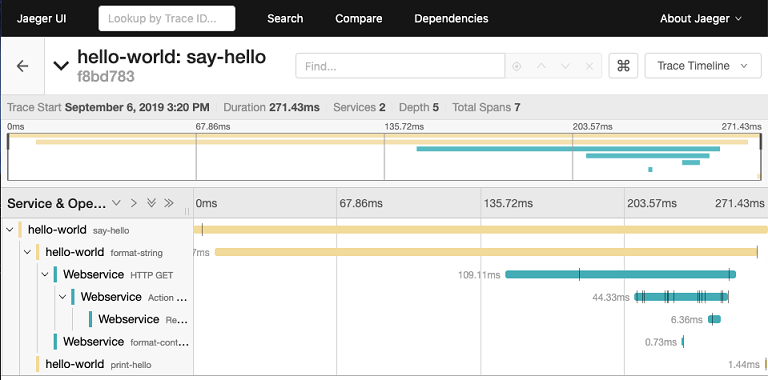

# **Using Jaeger to monitor and troubleshoot**
When we want to monitor and troubleshoot transactions in a complex distributed system, we need something a bit more powerful than what we have just learned. Of course, we can and should continue to instrument our code with meaningful logging messages, yet we need something more on top of that. This more is the capability to trace a single request or transaction end to end, as it flows through the system consisting of many application services. Ideally, we would also want to capture other interesting metrics such as the time spent on each component versus the total time that the request took.

Luckily, we do not have to reinvent the wheel. There is battle-tested open source software out there that helps us to achieve exactly the aforementioned goals. One example of such an infrastructure component or software is Jaeger (https://www.jaegertracing.io/). When using Jaeger, you run a central Jaeger server component and each application component uses a Jaeger client that will forward debug and tracing information transparently to the Jaeger server component. There are Jaeger clients for all major programming languages and frameworks, such as Node.js, Python, Java, and .NET.

We will not go into all the intimate details of how to use Jaeger in this book, but will give a high-level overview of how it works conceptually:

- First, we define a Jaeger tracer object. This object basically coordinates the whole process of tracing a request through our distributed application. We can use this tracer object and also create a logger object from it, which our application code can use to generate log items, similar to what we did in the previous Python and .NET examples.
- Next, we have to wrap each method in the code that we want to trace with what Jaeger calls a span. The span has a name and provides us with a scope object. Let's look at some C# pseudo-code that illustrates that:

```
public void SayHello(string helloTo) {
  using(var scope = _tracer.BuildSpan("say-hello").StartActive(true)) {
    // here is the actual logic of the method
    ...
    var helloString = FormatString(helloTo);
    ...
  }
}
```
As you can see, we're instrumenting the **SayHello** method. With a **using** statement creating a span, we're wrapping the whole application code of this method. We call the span "**say-hello**", and this will be the ID with which we can identify the method in the trace log produced by Jaeger.

Note that the method calls another nested method, **FormatString**. This method will look quite similar in regard to the code needed for instrumenting it:

```
public void string Format(string helloTo) {
   using(var scope = _tracer.BuildSpan("format-string").StartActive(true)) {
       // here is the actual logic of the method
       ...
       _logger.LogInformation(helloTo);
       return 
       ...
   }
}
```

The span that our **tracer** object builds in this method will be a child span of the calling method. This child span here is called **"format-string"**. Also note that we are using the logger object in the preceding method to explicitly generate a log item of level **INFO**.

In the code included with this chapter, you can find a complete sample application written in C# consisting of a Jaeger server container and two application containers called client and library that use the Jaeger client library to instrument the code.

Navigate to the project folder:
```
cd C:\DJK\Lab-04-Debugging\sample\jaeger-sample\
```
Next, start the Jaeger server container:

```
$ docker run -d --name jaeger \
   -e COLLECTOR_ZIPKIN_HTTP_PORT=9411 \
   -p 5775:5775/udp \
   -p 6831:6831/udp \
   -p 6832:6832/udp \
   -p 5778:5778 \
   -p 16686:16686 \
   -p 14268:14268 \
   -p 9411:9411 \
   jaegertracing/all-in-one:1.13

PS> docker run -d --name jaeger `
   -e COLLECTOR_ZIPKIN_HTTP_PORT=9411 `
   -p 5775:5775/udp `
   -p 6831:6831/udp `
   -p 6832:6832/udp `
   -p 5778:5778 `
   -p 16686:16686 `
   -p 14268:14268 `
   -p 9411:9411 `
   jaegertracing/all-in-one:1.13

```

Next, we need to run the API, which is implemented as an ASP.NET Core 2.2 Web API component. Navigate to the **api** folder and start the component:
- https://download.visualstudio.microsoft.com/download/pr/279de74e-f7e3-426b-94d8-7f31d32a129c/e83e8c4c49bcb720def67a5c8fe0d8df/dotnet-sdk-2.2.207-win-x64.exe

```
dotnet run
info: Jaeger.Configuration[0]
      Initialized Tracer(ServiceName=Webservice, Version=CSharp-0.3.4.0, Reporter=CompositeReporter(Reporters=RemoteReporter(Sender=UdpSender(UdpTransport=ThriftUdpClientTransport(Client=127.0.0.1:6831))), LoggingReporter(Logger=Microsoft.Extensions.Logging.Logger`1[Jaeger.Reporters.LoggingReporter])), Sampler=ConstSampler(True), IPv4=-1442970056, Tags=[jaeger.version, CSharp-0.3.4.0], [hostname, S2PC1], [ip, 169.254.6.56], ZipkinSharedRpcSpan=False, ExpandExceptionLogs=False, UseTraceId128Bit=False)
info: Microsoft.AspNetCore.DataProtection.KeyManagement.XmlKeyManager[0]
      User profile is available. Using 'C:\Users\srvuser1\AppData\Local\ASP.NET\DataProtection-Keys' as key repository and Windows DPAPI to encrypt keys at rest.
info: Microsoft.AspNetCore.DataProtection.KeyManagement.XmlKeyManager[58]
      Creating key {5a49fccd-ce3c-4797-b432-ffdfe6ffd157} with creation date 2020-06-19 12:18:38Z, activation date 2020-06-19 12:18:38Z, and expiration date 2020-09-17 12:18:38Z. 
info: Microsoft.AspNetCore.DataProtection.Repositories.FileSystemXmlRepository[39]
      Writing data to file 'C:\Users\srvuser1\AppData\Local\ASP.NET\DataProtection-Keys\key-5a49fccd-ce3c-4797-b432-ffdfe6ffd157.xml'.
Hosting environment: Development
Content root path: C:\DJK\Lab-04-Debugging\sample\jaeger-sample\api
Now listening on: http://0.0.0.0:5000
Application started. Press Ctrl+C to shut down.
```
Starting the API component of the Jaeger sample


Running the client component of the Jaeger sample application
In the preceding output, you can see the three spans marked with red arrows, starting from the innermost to the outermost span. We can also use the graphical UI of Jaeger to see more details:

```
dotnet run Fredy Bonjur
info: Jaeger.Configuration[0]
      Initialized Tracer(ServiceName=hello-world, Version=CSharp-0.3.4.0, Reporter=CompositeReporter(Reporters=RemoteReporter(Sender=UdpSender(UdpTransport=ThriftUdpClientTransport(Client=127.0.0.1:6831))), LoggingReporter(Logger=Microsoft.Extensions.Logging.Logger`1[Jaeger.Reporters.LoggingReporter])), Sampler=ConstSampler(True), IPv4=-1442970056, Tags=[jaeger.version, CSharp-0.3.4.0], [hostname, S2PC1], [ip, 169.254.6.56], ZipkinSharedRpcSpan=False, ExpandExceptionLogs=False, UseTraceId128Bit=False)
info: Jaeger.Reporters.LoggingReporter[0]
      Span reported: 5e29d029153c16f3:b34734224d329413:5e29d029153c16f3:1 - format-string
info: FundamentalsOfDocker.ch06.Hello[0]
      Bonjur, Fredy!
info: Jaeger.Reporters.LoggingReporter[0]
      Span reported: 5e29d029153c16f3:bd3319c80aa6e2a3:5e29d029153c16f3:1 - print-hello  
info: Jaeger.Reporters.LoggingReporter[0]
      Span reported: 5e29d029153c16f3:5e29d029153c16f3:0:1 - say-hello
```

In your browser, navigate to http://localhost:16686 to access the Jaeger UI.

In the Search panel, make sure the hello-world service is selected. Leave Operation as all and click the Find Traces button. You should see the following:


The Search view of the Jaeger UI
Now click on the (only) entry hello-world: say-hello to see the details of that request:


Details of the request as reported by Jaeger

In the preceding screenshot, we can see how the request starts in the **hello-world** component in the **say-hello** method, then navigates to the format-string method in the same component, which, in turn, calls an endpoint in Webservice, whose logic is implemented in the **FormatController** controller. For each and every step, we see the exact timings as well as other interesting information. You can drill down in this view to see even more details.

Before you continue, you may want to take some time and browse through the code of the API and the client component that we just used for this demo.

To clean up, stop the Jaeger server container:
```
$ docker container rm -f jaeger
```

Also stop the API with Ctrl + C.