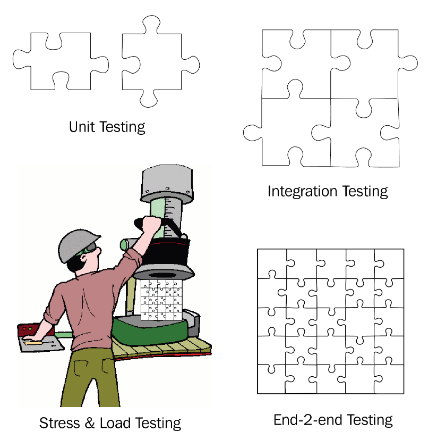

# Using Docker to Supercharge Automation

## Executing simple admin tasks in a container

! We need  to run a perl script  , but this do not exist on local machine !!
```c
cat sample.txt | perl -lpe 's/^\s*//'
```

### Create prerequisite

```bash
mkdir code
cd ./code

echo '1234567890'>> sample.txt 
echo '  This is some text '>> sample.txt
echo '   another line of text '>> sample.txt
echo ' more text '>> sample.txt
echo '     final line '>> sample.txt

```

## Run in Docker (PS)
```PowerShell
docker container run --rm -it `
    -v $pwd/code:/usr/src/app `
    -w /usr/src/app `
    perl:slim sh -c "cat sample.txt | perl -lpe 's/^\s*//'"
```

## If you use Mac  , this method can be use to run old perl scripts
```bash
docker container run -it --rm \
    -v $(pwd):/usr/src/app \
    -w /usr/src/app \
    perl:<old-version> perl your-old-perl-script.pl
```

**Tip:** A lot of people use quick and dirty Python scripts or mini apps to automate tasks that are not easily coded with, say, Bash. Now if the Python script has been written in **Python 3.7** and you only happen to have **Python 2.7** installed, or no version at all on your machine, then the easiest solution is to execute the script inside a container.

## Run docker with python

```powershell
docker container run --rm -it -v $pwd/code:/usr/src/app -w /usr/src/app python:3.7.4-alpine python stats.py sample.txt
docker container run --rm -it -v $pwd/code:/usr/src/app -w /usr/src/app python:3.7.4-alpine python stats.py sample2.txt
```

### The beauty of this approach is that this Python script will now run on any computer with any OS installed, as long as the machine is a Docker host and, hence, can run containers.

# Using Docker to power a CI/CD pipeline
For each serious software project out there, it is highly recommended to have plenty of tests in place. There are various test categories such as unit tests, integration tests, stress and load tests, and end-to-end tests. I have tried to visualize the different categories in the following screenshot:




- Run a tool not available on the host in a container
- Use a container to run test scripts or code against an application service
- Build a simple CI/CD pipeline using Docker 

