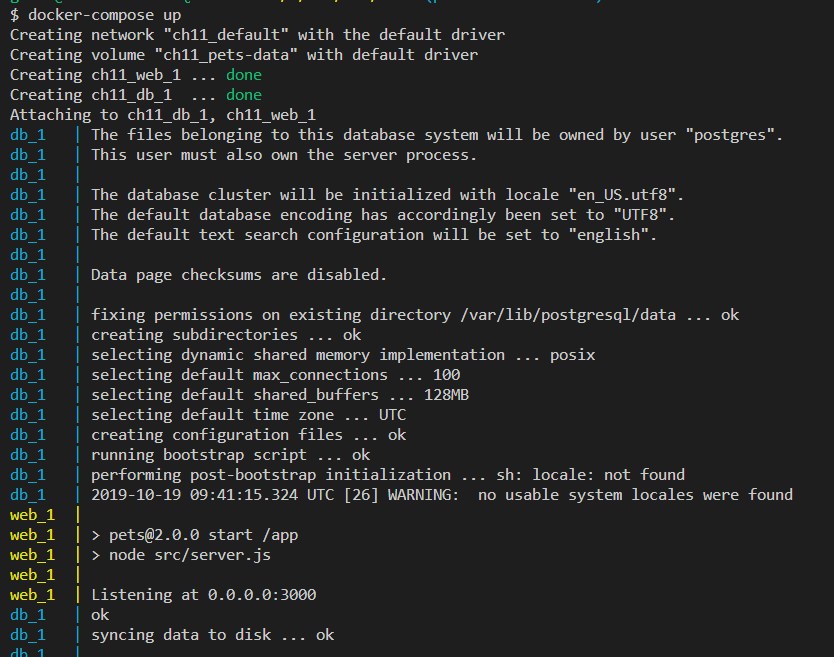
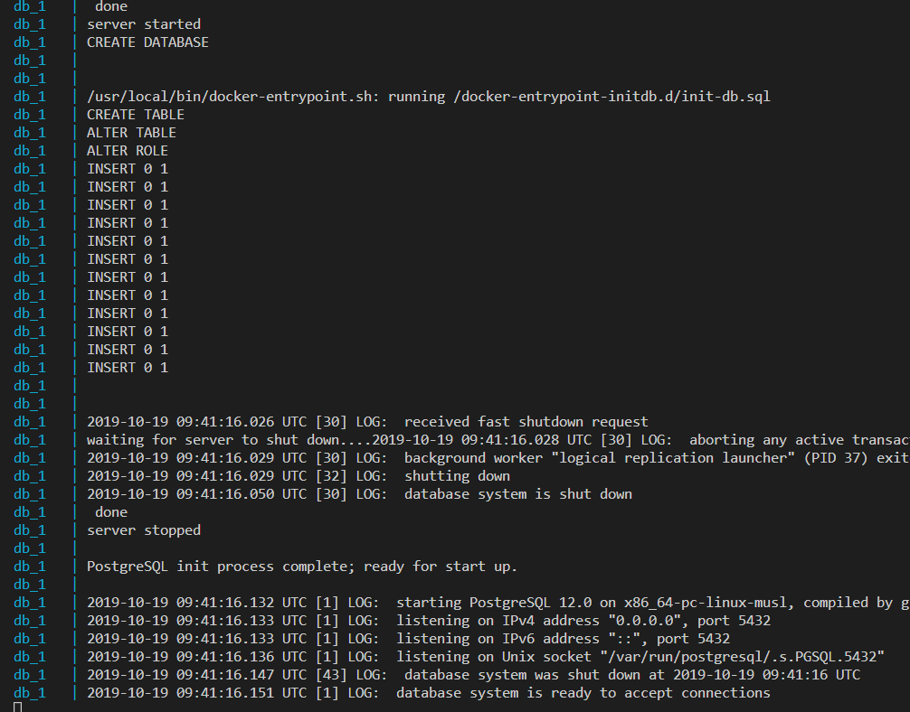

# Running a multi-service application

In most cases, applications do not consist of only one monolithic block, but rather of several application services that work together. When using Docker containers, each application service runs in its own container. When we want to run such a multi-service application, we can, of course, start all the participating containers with the well-known docker container run command, and we have done this in previous chapters. But this is inefficient at best. With the Docker Compose tool, we are given a way to define the application in a declarative way in a file that uses the YAML format.

Let's have a look at the content of a simple **docker-compose.yml** file:

```
version: "2.4"
services:
 web:
    image: fundamentalsofdocker/ch11-web:2.0
    build: web
    ports:
    - 80:3000
 db:
    image: fundamentalsofdocker/ch11-db:2.0
    build: db
    volumes:
    - pets-data:/var/lib/postgresql/data

volumes:
 pets-data:
```

The lines in the file are explained as follows:

- **version**: In this line, we specify the version of the Docker Compose format we want to use. At the time of writing, this is version 2.4.
- **services**: In this section, we specify the services that make up our application in the services block. In our sample, we have two application services and we call them web and **db**:
**web**: The web service is using an image called **fundamentalsofdocker/ch11-web:2.0**, which, if not already in the image cache, is built from the Dockerfile found in the web folder . The service is also publishing container **port 3000**to the host port **80**.
- **db**: The db service, on the other hand, is using the image name **fundamentalsofdocker/ch11-db:2.0**, which is a customized **PostgreSQL database**. Once again, if the image is not already in the cache, it is built from the Dockerfile found in the **db** folder . We are mounting a volume called **pets-data** into the container of the db service.
- **volumes**: The volumes used by any of the services have to be declared in this section. In our sample, this is the last section of the file. The first time the application is run, a volume called **pets-data**will be created by Docker and then, in subsequent runs, if the volume is still there, it will be reused. This could be important when the application, for some reason, crashes and has to be restarted. Then, the previous data is still around and ready to be used by the restarted database service.

Note that we are using **version 2.x** of the Docker Compose file syntax. This is the one targeted toward deployments on a single **Docker host**. There exists also a **version 3.x** of the Docker Compose file syntax. This version is used when you want to define an application that is targeted either at **Docker Swarm or Kubernetes**. We will discuss this in more detail starting with, Orchestrators.

# Building images with Docker Compose
Navigate to the ch11 subfolder of the fods folder and then build the images:

```
~\Lab-10-Docker-Compose\docker-compose
docker-compose build
```

If we enter the preceding command, then the tool will assume that there must be a file in the current directory called docker-compose.yml and it will use that one to run. In our case, this is indeed the case and the tool will build the images.

In your Terminal window, you should see an output similar to this:


Building the Docker image for the web service

In the preceding screenshot, you can see that **docker-compose**first downloads the base image **node:12.12-alpine**, for the web image we're building from Docker Hub. Subsequently, it uses the **Dockerfile** found in the **web** folder to build the image and names it **fundamentalsofdocker/ch11-web:2.0**. But this is only the first part; the second part of the output should look similar to this:


Building the Docker image for the db service
Here, once again, **docker-compose** pulls the base image, **postgres:12.0-alpine**, from Docker Hub and then uses the Dockerfile found in the **db** folder to build the image we call **fundamentalsofdocker/ch11-db:2.0**.

# Running an application with Docker Compose

Once we have built our images, we can start the application using Docker Compose:
```
$ docker-compose up
```
The output will show us the application starting. We should see the following:



Running the sample application, part 1
In this first part of the output, we see how Docker Compose does the following:

- Creates a bridge network called **ch11_default**
- Creates a volume called **ch11_pets-data**
- Creates the two services, **ch11_web_1** and **ch11_db_1**, and attaches them to the network

Docker Compose then also shows log output generated by the database (blue) and by the web service (yellow) that are both stating up. The third last line in the output shows us that the web service is ready and listens at port **3000**. Remember though that this is the container port and not the host port. We have mapped container port **3000** to host port **80**, and that is the port we will be accessing later on.

Now let's look at the second part of the output:



Running the sample application, part 2

We have shortened the second part of the output a bit. It shows us how the database finalizes its initialization. We can specifically see how our initialization script, **init-db.sql**, is applied, which defines a database and seeds it with some data.

We can now open a browser tab and navigate to **http://localhost:3000/pet**. We should be greeted by a wild animal whose picture I took at the Masai Mara national park in Kenya:


The sample application in the browser

Refresh the browser a few times to see other cat images. The application selects the current image randomly from a set of 12 images whose URLs are stored in the database.

As the application is running in interactive mode and, thus, the Terminal where we ran Docker Compose is blocked, we can cancel the application by pressing Ctrl + C. If we do so, we will see the following:

```
^CGracefully stopping... (press Ctrl+C again to force)
Stopping ch11_web_1 ... done
Stopping ch11_db_1 ... done
```

We will notice that the database and the web services stop immediately. Sometimes, though, some services will take about 10 seconds to do so. The reason for this is that the database and the web service listen to, and react to, the **SIGTERM**signal sent by Docker while other services might not, and so Docker kills them after a predefined timeout interval of 10 seconds.

If we run the application again with **docker-compose up**, the output will be much shorter:


Output of docker-compose up

This time, we didn't have to download the images and the database didn't have to initialize from scratch, but it was just reusing the data that was already present in the **pets-data**volume from the previous run.

We can also run the application in the background. All containers will run **as daemons**. For this, we just need to use the **-d** parameter, as shown in the following code:

```
$ docker-compose up -d
Starting docker-compose_web_1 ... done
Starting docker-compose_db_1  ... done
```

Docker Compose offers us many more commands than just up. We can use the tool to list all services that are part of the application:
```
docker-compose ps
```


Output of docker-compose ps

This command is similar to **docker container ls**, with the only difference being that **docker-compose** only lists containers or services that are part of the application.

To stop and clean up the application, we use the **docker-compose down** command:

```
 docker-compose down
Stopping ch11_web_1 ... done
Stopping ch11_db_1 ... done
Removing ch11_web_1 ... done
Removing ch11_db_1 ... done
Removing network ch11_default
```

If we also want to remove the volume for the database, then we can use the following command:

```
docker volume rm ch11_pets-data
```

Alternatively, instead of using the two commands, **docker-compose down** and **docker volume rm <volume name>**, we can combine them into a single command:

```
$ docker-compose down -v
```

Here, the argument **-v**(or **--volumes**) removes named volumes declared in the **volumes** section of the **compose** file and anonymous volumes attached to containers.

Why is there a **docker-compose** prefix in the name of the volume? In the **docker-compose.yml** file, we have called the volume to use **pets-data**. But, as we have already mentioned, Docker Compose prefixes all names with the name of the parent folder of the **docker-compose.yml** file plus an underscore. In this case, the parent folder is called **docker-compose**. If you don't like this approach, you can define a project name explicitly, for example, as follows:

```
$ docker-compose -p my-app up -d
```
which uses a project name my-app for the application to run under.

# Scaling a service

Now, let's, for a moment, assume that our sample application has been live on the web and become very successful. Loads of people want to see our cute animal images. So now we're facing a problem, since our application has started to slow down. To counteract this problem, we want to run multiple instances of the web service. With Docker Compose, this is readily done.

Running more instances is also called scaling up. We can use this tool to scale our web service up to, say, three instances:

```
docker-compose up --scale web=3
```
If we do this, we are in for a surprise. The output will look similar to the following screenshot:


Output of docker-compose --scale
The second and third instances of the web service fail to start. The error message tells us why: we cannot use the same host port **80** more than once. When instances 2 and 3 try to start, Docker realizes that port **80** is already taken by the first instance. What can we do? Well, we can just let Docker decide which host port to use for each instance.

If, in the **ports** section of the **compose**file, we only specify the container port and leave out the host port, then Docker automatically selects an ephemeral port. Let's do exactly this:

- First, let's tear down the application:

```
$ docker-compose down
```
- Then, we modify the docker-compose.yml file to look as follows:

```
version: "2.4"
services:
  web:
    image: fundamentalsofdocker/ch11-web:2.0
    build: web
    ports:
      - 3000
  db:
    image: fundamentalsofdocker/ch11-db:2.0
    build: db
    volumes:
      - pets-data:/var/lib/postgresql/data

volumes:
  pets-data:
```
Sample in `docker-compose_scale.yml`

- Now, we can start the application again and scale it up immediately after that: 

```
$ docker-compose up -d
$ docker-compose up -d --scale web=3
Starting ch11_web_1 ... done
Creating ch11_web_2 ... done
Creating ch11_web_3 ... done
```
- If we now do **docker-compose ps**, we should see the following screenshot:


Output of docker-compose ps

- As we can see, each service has been associated to a different host port. We can try to see whether they work, for example, using curl. Let's test the third instance, docker-compose_web_3:

```
$ curl -4 localhost:32769
```
http://localhost:32769/

Pets Demo Application
The answer, Pets Demo Application, tells us that, indeed, our application is still working as expected. Try it out for the other two instances to be sure.